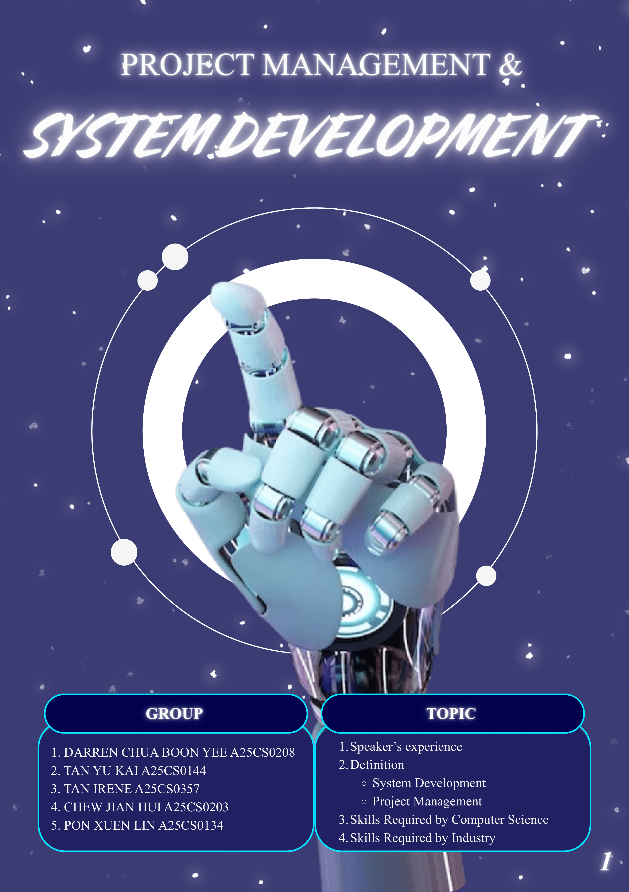
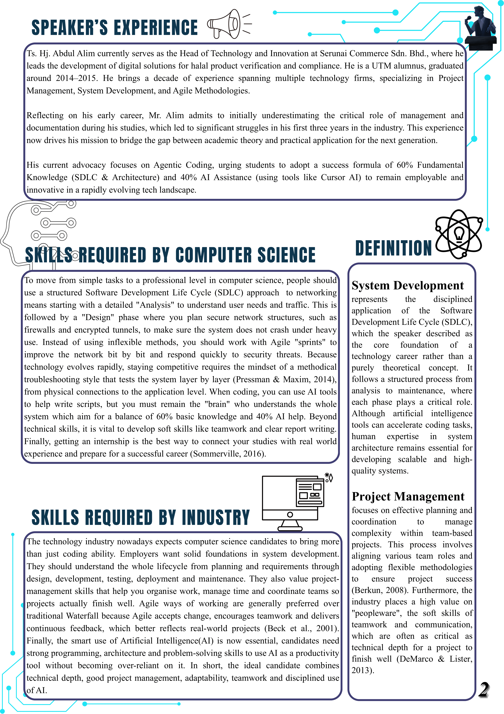
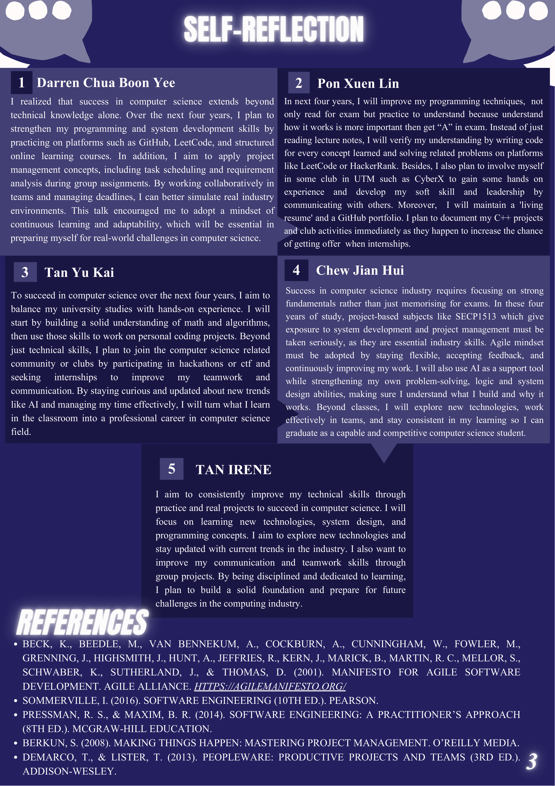

## Assignment 3: Report

Through the Industrial Talk 2 shared by **Ts. Hj. Abdul Alim**, our group designed an academic report.

[Click here to view my Report (PDF)](./TIS%20Assignment3.pdf)

---

## 📝 Reflection

I learned that a professional technology career is built on the Software Development Life Cycle (SDLC), not just writing code.
Through Mr. Alim's experience, I realized that documentation and management are critical for career success.
I understood the "60/40 rule"—using AI for 40% of the work while keeping 60% as my own fundamental knowledge.
